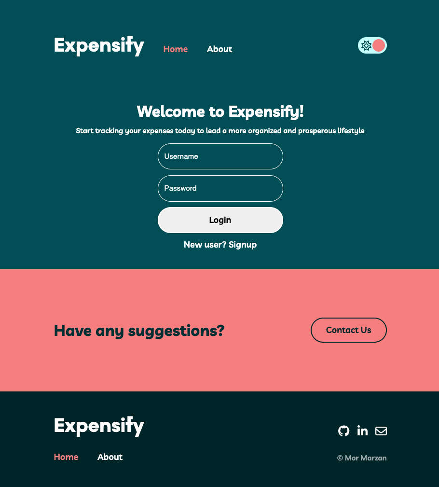
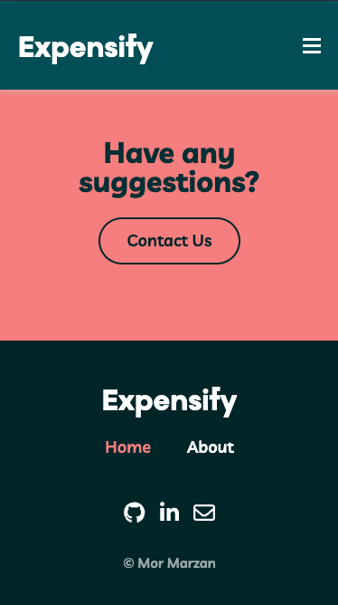
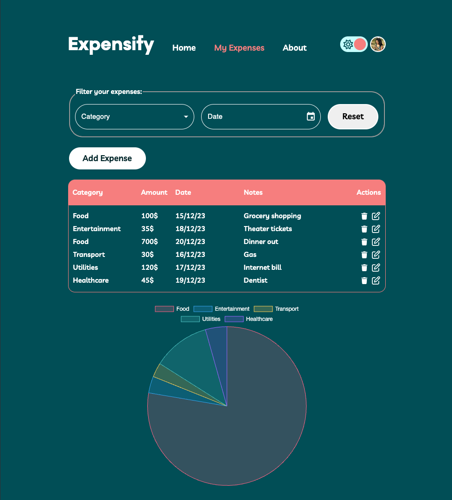
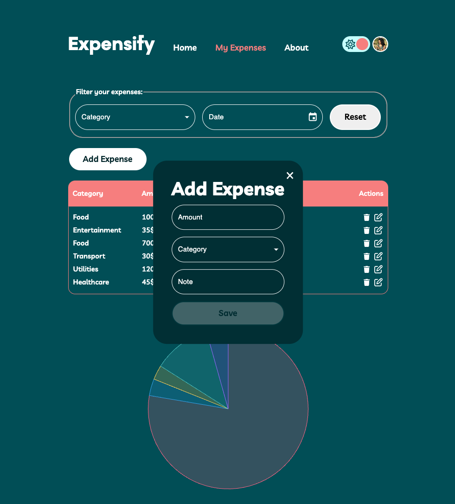

# 💸 Expensify - Personal Expense Tracker Application

Welcome to the Expensify! This application is a personal expense tracker that allows users to input, categorize, and visualize their expenses over time. Built with React, Node.js and MongoDB, it's designed to provide a seamless tracking experience. Responsive design ensures that the app looks great on all devices, from desktops to mobile phones.

## 📌 Overview of Interface

Check out the live version of the app here:
[Visit Expensify](https://expensify-backend-wqfx.onrender.com/)






## 🛠️ Technologies Used
### Frontend
- **React** - The main library used for building the user interface.
- **SASS** - An extension of CSS that adds power and elegance to the basic language.
- **Redux** - Used for state management.
- **Material-UI (MUI)** - Used for UI components and styling.
- **Chart.js** - For visualizing expenses in a pie chart.

### Backend
- **Node.js & express** - The main framework used for creating the RESTful API.
- **MongoDB** - The database used to store user and expense data.
- **bcrypt & Cryptr** - for authentication and Security

## 📚 API Documentation
### Authentication Endpoints
- POST /api/auth/login - Log in a user.
- POST /api/auth/logout - Log out the current user.
- POST /api/auth/signup - Sign up a new user.

### Expense Endpoints
- GET /api/expense  - Retrieve all expenses for the logged-in user.
- GET /api/expense/:id - Retrieve a specific expense by ID for the logged-in user.
- PUT /api/expense/ - Update a specific expense by ID. The request body should include amount and category, with an optional note.
- DELETE /api/expense/ -  Delete a specific expense by ID.
- POST /api/expense - Add a new expense. The request body should include amount, category, and an optional note.

## 🚀 Getting Started

These instructions will get you a copy of the project up and running on your local machine for development and testing purposes.

### Prerequisites

Before you begin, ensure you have the following installed:
- Node.js: [Download & Install Node.js](https://nodejs.org/en/download/) and the npm package manager.

### Installation

To set up the project locally, follow these steps:

1. **Clone the Repositories**

   ```bash
   git clone https://github.com/MorMarzan/Expensify-backend
   cd expensify-backend
   ```

   ```bash
   git clone https://github.com/MorMarzan/Expensify-frontend
   cd expensify-frontend
   ```

2. **Install Dependencies in both projects**

```sh
npm i
```

3. **Set Up the Environment Variables**
In the backend directory, create a .env file with the following content:
SECRET_CRYPTR=expensify-rocks

4. **Run the Application**
 ### frontend
```sh
npm run dev
```

 ### backend
```sh
npm run server:dev
```

### 💡 Contact
For any queries, you can reach us at mormarzan@gmail.com

### 📝 License
This project is licensed under the MIT License - see the LICENSE.md file for details.